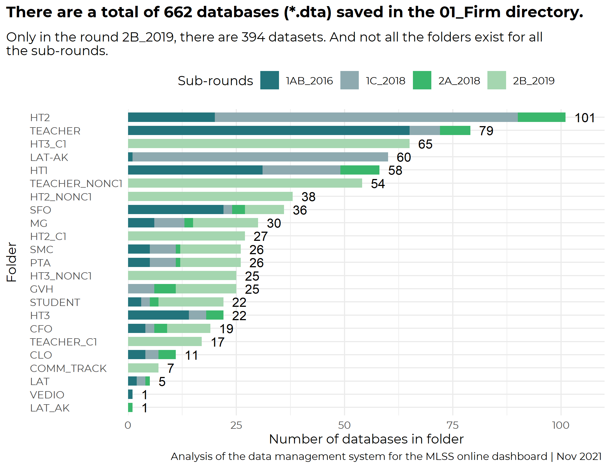
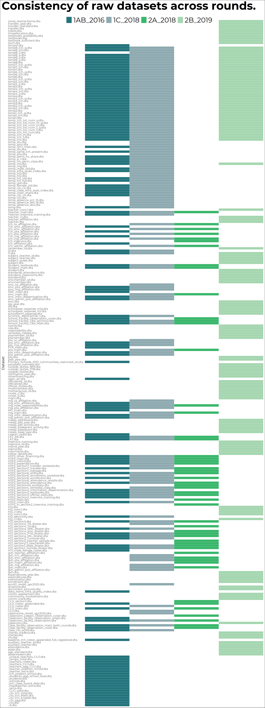

<head>

<link href="https://fonts.googleapis.com/css2?family=Lato:wght@100;300;700&display=swap" rel="stylesheet">

</head>

```{r include = FALSE}
knitr::opts_chunk$set(echo = F, warning = F, message = F, fig.pos= "h")
library(dplyr)
dir_project <- dirname(getwd())
dir_R <- file.path(dir_project, "R")
dir_tables <- "tables"

#run paths
source(file.path(dir_R, "paths.R"))


```

For the dashboard development, there are two relevant directories (folder) 05_Data and 06_Coding.

# Coding architecture

Throughout the document, the words folder and directory are use interchangeable.


## Rounds

There is a dedicated directory for each round. Thus far, there is a folder for `01_Baseline, 02_Midline, 03_Endline`, and `04_Longitudinal`. Each of these rounds is subdivided into more directories that are based on sub-rounds (e.g. `01_1AB_2016`, `02_1C_2018`, `01_2A_2018`, and `01_2B_2019`).

## Definition of directory paths

All the paths are defined in **`06_Coding > 00_00_00_Master_NEW.do`**. This dofile must be ran before starting any analysis because all the paths to the key directories is defined here.

### Data

For each round, the global path is defined as `bl16`, `bl18`, `md2a`,`ml2b`, `el_a`, `el_b` :

    global bl16         "${root}/01_Baseline/01_1AB_2016"
    global bl18         "${root}/01_Baseline/02_1C_2018"
    global ml2a         "${root}/2. Midline/01_2A_2018"
    global ml2b         "${root}/2. Midline/01_2B_2019"
    global el_a       "${root}/03_Endline/01_3AB_2021"
    global el_b       "${root}/03_Endline/02_3B_2021"

-   `${root}` is defined as `MESIP_New_Internal/05_Data`

-   The directory that contains the raw data is defined as `dta_raw` and points to `01/_Firm`

-   The path to the intermediate data is defines as `dta_inter` and points to `02_Cleaned`

-   The path for the harmonized data is `dta_har` and points to `03_Harmonized`.

Thus, for example, if the raw data from baseline 16 is to be called, the user should point to: `$bl16/$dta_raw`.

### Dofiles

Dofile (`06_Coding > 00_00_00_Master_NEW.do`) also defines the paths to the dofiles of the project:

    global bl16_do             "${do}/01_Baseline/01_1AB_2016"
    global bl18_do            "${do}/01_Baseline/02_1C_2018"
    global ml2a_do            "${do}/02_Midline/01_2A_2018"
    global ml2b_do            "${do}/02_Midline/01_2B_2019"
    global bl_combine_do    "${do}/01_Baseline/03_Combination"
    global bl_clean_do      "${do}/01_Baseline/04_Cleaning"
    global bl_derive_do     "${do}/01_Baseline/05_Derivation"

# Harmonization of the data

This section describes the harmonization process.

## Questions to Archit

What is the difference between the harmonization coding of 02_1C_2018 and 01_1AB_2016? at a first glance, both seem to be doing the same.

## Code

```{R}

source(file.path(dir_R, "count_dofiles_harm.R"))


```

Within each sub-round folder (e.g. 01_Baseline/01_1AB_2016), there is a folder called 02_Harmonization. That folder contains all the coding (dofiles) to read the raw data, clean it, and to harmonize it with the other rounds. The input data for this process is the raw data stored in `dta_raw` (`01_Firm` directory). And the output of this system is stored in `dta_har` (`03_Harmonized`).

(\*\*ask Archit to describe the main objective of these dofiles)

This system is composed of `r number_dofiles` dofiles:

-   `r text_dofiles`

The most important file of this system is **00.Append.**\* because all the other scripts are ran from this *"master"* script. In simpler words, the `00.Append` runs all the other scripts listed above. Apart from running all the scripts needed for the harmonization, this dofile creates to functions (or commands) that are used for all the other dofiles:

-   `mpss_scvalues` that harmonises the single select value labels

-   `mpss_kickout` that removes old options and recode them accordingly.

After defining these functions, the *00.Append* dofile runs all the other dofiles to mainly:

1.  Assign harmomized labels to the variables
2.  Append subrounds
3.  Save to the `03_Harmonized` directory.

Below is an example of the harmonization process for the CLO data:


    use "$path2/CLO/CLO_main.dta", clear

    ren qnum qq1
    ren moecode MOEcode
    ren class_id classid
    ren q1_name school_name
    ren q3 enum_first_visit1
    ren q5 enumerator_name2
    ren q13 teachername
    ren q14 teacherid
        * CB
    gen sup_date = date(q15a3, "DMY")
    drop q15a3
    ren q15a4 reasons


    replace q7=. if q7==777 | q7==999
    gen q7new=1 if q7>=10
    replace q7new=0 if q7<10
    replace q7new=. if q7==.
    tostring q7, replace
    gen hh1=substr(q7,1,1) if q7new==0
    replace hh1=substr(q7,1,2) if q7new==1
    gen minu1=substr(q7,3,.) if q7new==0
    replace minu1=substr(q7,4,.) if q7new==1
    replace minu1="00" if q7=="7"
    replace minu1="00" if q7=="8"
    replace minu1="00" if q7=="9"
    replace minu1="00" if q7=="10"
    replace minu1="00" if q7=="11"
    replace minu1="00" if q7=="12"

    drop q7new q7

As can be seen in the example above, even though there is some level of atomation, each dataset requires a manual (very specific) manipulation of the variable names for the harmonization to be effective. Apart from the manual manipulation, in the harmonization system there are some other customed functions that help with the consistency of the naming protocols between rounds. For example, in the dofile `02.CLO_recode`, there is a note that explains what the `fre` command does:

    *Task 1:
    *i) the variable names in BL18 align with the BL18 instrument and
    *ii) value labels align.
    *Using fre command

Thus, at it was shown in the description of the harmonization process, this system relies of a complex combination of customed functions and manual coding for the harmonization to be succesful. The next section describes in detail the data used for the harmonization.

## Data

This section explores the data that is used as an input for the harmonization process and describes what the output of the process is

### Firm data

```{R}

table_summary_firm <- rio::import(file.path(dir_tables, "summary_firm_data.rds"))

#run count of matched Dofiles
source(file.path(dir_R, "count_match_databases.R"))

```

As it was described above, the harmonization step gets the data from the `01_Firm` directory. As can be seen in the Figure below,  there are `r total_dbs` stata datasets (*.dta) across all rounds of Baseline and Midline, `r inRound1A` in round 1B (01_1AB_2016), `r inRound1B` in round1C (02_1C_2018), `r inRound2A` (01_2A_2018), and `r inRound2B` (01_2B_2019). From Figure X below, it noticeable that there are some folders that do exist in one sub-round but do not exist in the rest. For example, the folders HT2_NONC1, TEACHER_NONC1, COMMM_TRACK only exist in round 2B_2019. Another example is the folder HT2 that exists in all the sub-rounds but in the 2B_2019. In summary, what Figure X below shows is that there is that there is great number of databases saved in the raw data (01_Firm) and that there is an important level of discrepancy between the structure of the directories between rounds.

{width="13cm"}


To assess the level of heteregeonecity between rounds, the table below shows all the databases stored in the folder `01_Firm` of the Baseline rounds `01_1AB_2016` and `02_1C_2018` and the Midline's `01_2A_2018` and `01_2B_2019`. The main objective of this Figure is to map which datasets exist in round 1B (01_1AB_2016), round 1C (02_1C_2018), Round 2A (`01_2A_2018`), Round 2B (`01_2B_2019`) and in all the rounds. Moreover, the Figure attempts to show the volume of data contained by each round and the difference in terms naming across directories.

In summary, from the `r filesRound1` datasets that exist in Baseline's round 1B and round 1C, only `r inBoth1` (`r inBoth1_perc`) exist in both sub- rounds. Moreover, from the `r filesRound2` stored in Midline's raw data directory, **none** exist in both sub-rounds. This finding shows, that there's is a big inconsistency in file names between sub-rounds. And this is more notorious for the midline raw data.




The table below presents lists all the datasests that are saved in the raw directory and indicates whether they exist for each round.

`r knitr::kable(table_summary_firm, caption = "Summary of databases stored in 01_Firm directory.")`
