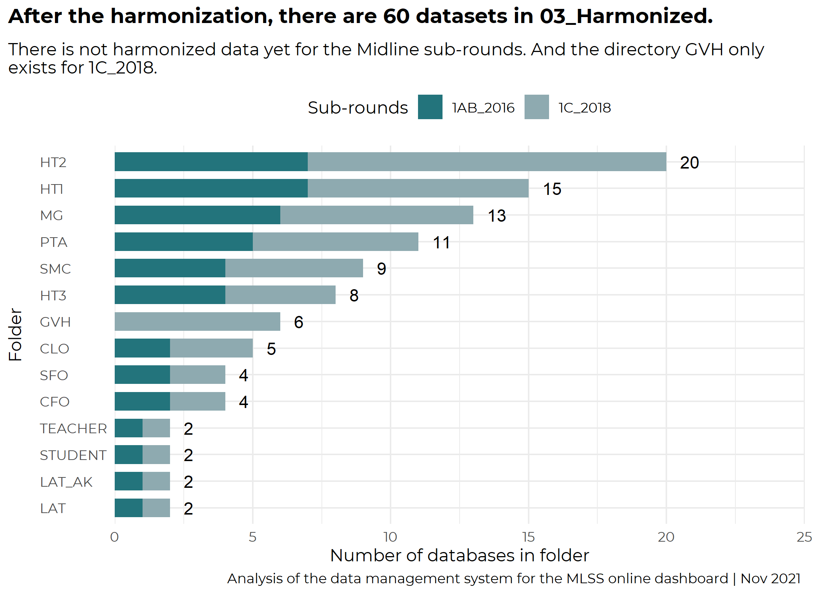
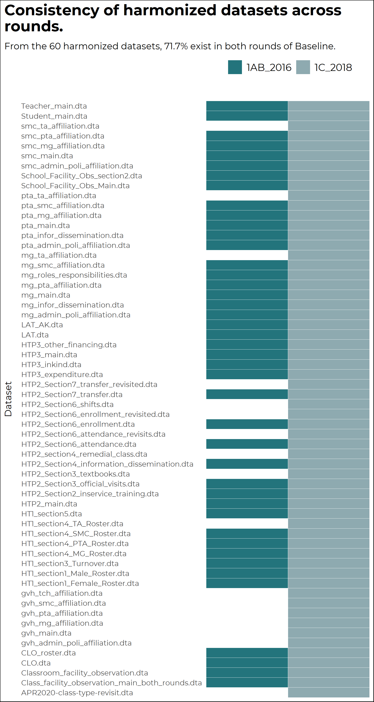

# Summary

The objective of this Concept Note is to provide a clear and detailed plan to set up and online dashboard to disseminate the main findings of the The Malawi Longitudinal School Survey (MLSS). This report is divided in X sections: **Section 1** describes the data management system of all the rounds of the survey. Based on the findings of this section, **Section 2**  proposes a data management system for an efficient implementation of the dashboard; **Section3** describes the elements of the dashboard and the understanding of the data needs; **Section 4** Outlines the software that is recommended for the set up of the dashboard; Finally, **Section 5** presents a workplan for the development of the dashboard.

The flowchart below summarise the data management system of the Longitudinal MLSS survey. The objective of mapping and assessing each step in this process is to identify which processes are recommended to occur off-line and which are likely to be atumoatized by the online dashboard.


and assessment of the overall data management system of the MLSS data, from its raw format up to the indicator creation;

*school conditions, practices and learning outcomes

```{r include = FALSE}
knitr::opts_chunk$set(echo = F, warning = F, message = F, fig.pos= "h")
library(dplyr)
dir_project <- dirname(getwd())
dir_R <- file.path(dir_project, "R")
dir_tables <- "tables"

#run paths
source(file.path(dir_R, "paths.R"))


```

For the dashboard development, there are two relevant directories (folder) 05_Data and 06_Coding.

# Data Management System of the MLSS survey

The objective of this section is to map and assess every process of the MLSS data management system and to identify the likelihood of an online dashboard to atomate these processes. As it is indicated in the FIgure X [flow chart] the system starts with the raw data (data that it delvered to the annalytical team by the survey firm. Since the MLSS is a Longitudinal Survey (there are multiple rounds of the data), the aim of this system is to clean the raw data, conduct neccessary manipulations, and create indicators about the school conditions, practices, and learning outcomes that can be traced over time.

* Assessment of the raw data
* Harmonization process
* Assessment of the harmonization data
* Indicators

## Assessment of the raw data (01_Firm directory)

```{R}

table_summary_firm <- rio::import(file.path(dir_tables, "summary_firm_data.rds"))

#run count of matched Dofiles
source(file.path(dir_R, "count_match_databases.R"))

```

This section explores the raw data, or the initial stage of the data management system. All this data is used as the main input for the harmonization process described in section [2.1].


The raw data for each sub-round -Baseline rounds `01_1AB_2016` and `02_1C_2018` and the Midline's `01_2A_2018` and `01_2B_2019`- is stored in the *05+Data/{round}/ `01_Firm`* directory. As can be seen in the Figure below,  there are `r total_dbs` stata datasets (*.dta) across all rounds of Baseline and Midline, `r inRound1A` in round 1B (01_1AB_2016), `r inRound1B` in round1C (02_1C_2018), `r inRound2A` (01_2A_2018), and `r inRound2B` (01_2B_2019). From Figure X below, it noticeable that there are some folders that do exist in one sub-round but do not exist in the rest. For example, the folders HT2_NONC1, TEACHER_NONC1, COMMM_TRACK only exist in round 2B_2019. Another example is the folder HT2 that exists in all the sub-rounds but in the 2B_2019. In summary, what Figure X below shows is that there is that there is great number of databases saved in the raw data (01_Firm) and that there is an important level of discrepancy between the structure of the directories between rounds.

{width="13cm"}


To assess the level of heteregeonecity between rounds, the table below shows all the databases stored in the folder `01_Firm` of the Baseline rounds `01_1AB_2016` and `02_1C_2018` and the Midline's `01_2A_2018` and `01_2B_2019`. The main objective of this Figure is to map which datasets exist in round 1B (01_1AB_2016), round 1C (02_1C_2018), Round 2A (`01_2A_2018`), Round 2B (`01_2B_2019`) and in all the rounds. Moreover, the Figure attempts to show the volume of data contained by each round and the difference in terms naming across directories.

In summary, from the `r filesRound1` datasets that exist in Baseline's round 1B and round 1C, only `r inBoth1` (`r inBoth1_perc`) exist in both sub- rounds. Moreover, from the `r filesRound2` stored in Midline's raw data directory, **none** exist in both sub-rounds. This finding shows, that there's is a big inconsistency in file names between sub-rounds. And this is more notorious for the midline raw data.


The table below presents lists all the datasets that are saved in the raw directory and indicates whether they exist for each round.


## Harmonization System

The main objective of this system is to solve the differences in terms of folder architecture, file and variable naming across rounds that was partially described in the previous section. This is a very important step in the Data Management System because without it, it would be not possible to conduct a Longitudinal analysis of the data. Thus the input for this process is the data stored in 01_Firm (described in the previous section) and the output for each round is stored in the 03_Harmonized folder (throughout the document, the words folder and directory are use interchangeable). As for all the codings, the scripts that run the harmonization process are stored in the 06_Coding/{round}/02_Harmonization directory.

Althogh there are some small differences between rounds, the harmonization approach is very similar for all:

1. All the paths to key folders are defied in a dofile called **00_00_00_Master_NEW.do**. Since this dofile defines the paths, it must be ran before starting or running any other script in the system. Below is an example of how the paths are defined:

For each round, the global path is defined as `bl16`, `bl18`, `md2a`,`ml2b`, `el_a`, `el_b` :
```
    global bl16         "${root}/01_Baseline/01_1AB_2016"
    global bl18         "${root}/01_Baseline/02_1C_2018"
    global ml2a         "${root}/2. Midline/01_2A_2018"
    global ml2b         "${root}/2. Midline/01_2B_2019"
    global el_a       "${root}/03_Endline/01_3AB_2021"
    global el_b       "${root}/03_Endline/02_3B_2021"

# `${root}` is defined as `MESIP_New_Internal/05_Data`
```

Thus, as it can see above, there is a dedicated and predefined directory for each round. Thus far, in the system, there is a folder for `01_Baseline, 02_Midline, 03_Endline`, and `04_Longitudinal`. Each of these rounds is subdivided into more directories that are based on sub-rounds (e.g. `01_1AB_2016`, `02_1C_2018`, `01_2A_2018`, and `01_2B_2019`).


In the harmonization system, the directory that contains the raw data is defined as `dta_raw` and points to `01/_Firm`; the path to the intermediate data is defines as `dta_inter` and points to `02_Cleaned`, and the path for the harmonized data is `dta_har` and points to `03_Harmonized`. Thus, for example, if the raw data from baseline 16 is to be called, the user should point to: `$bl16/$dta_raw`.

```{R}

source(file.path(dir_R, "count_dofiles_harm.R"))


```

2. Within each sub-round, there is a specific dofile to harmonize each module of the dataset. This system is composed of `r number_dofiles` dofiles:


*   `r text_dofiles`

The most important file of this system is **00.Append.**\* because all the other scripts are ran from this *"master"* script. In simpler words, the `00.Append` runs all the other scripts listed above. Apart from running all the scripts needed for the harmonization, this dofile creates to functions (or commands) that are used for all the other dofiles:   `mpss_scvalues` that harmonises the single select value labels, and  `mpss_kickout` that removes old options and recode them accordingly.

After defining these functions, the *00.Append* dofile runs all the other dofiles to mainly:

a.  Assign harmomized labels to the variables
b.  Append subrounds
c.  Save to the `03_Harmonized` directory.

Below is an example of the code used during harmonization process for the CLO data:

```
use "$path2/CLO/CLO_main.dta", clear

ren qnum qq1
ren moecode MOEcode
ren class_id classid
ren q1_name school_name
ren q3 enum_first_visit1
ren q5 enumerator_name2
ren q13 teachername
ren q14 teacherid
    * CB
gen sup_date = date(q15a3, "DMY")
drop q15a3
ren q15a4 reasons


replace q7=. if q7==777 | q7==999
gen q7new=1 if q7>=10
replace q7new=0 if q7<10
replace q7new=. if q7==.
tostring q7, replace
gen hh1=substr(q7,1,1) if q7new==0
replace hh1=substr(q7,1,2) if q7new==1
gen minu1=substr(q7,3,.) if q7new==0
replace minu1=substr(q7,4,.) if q7new==1
replace minu1="00" if q7=="7"
replace minu1="00" if q7=="8"
replace minu1="00" if q7=="9"
replace minu1="00" if q7=="10"
replace minu1="00" if q7=="11"
replace minu1="00" if q7=="12"

drop q7new q7

```    

As can be seen in the example above, even though there is some level of atomation, each dataset requires a manual (very specific) manipulation of the variable names for the harmonization to be effective. Apart from the manual manipulation, in the harmonization system there are some other customed functions that help with the consistency of the naming protocols between rounds. For example, in the dofile `02.CLO_recode`, there is a note that explains what the `fre` command does:

```
*Task 1:
*i) the variable names in BL18 align with the BL18 instrument and
*ii) value labels align.
*Using fre command

```
Thus, at it was shown in the description of the harmonization process, this system relies of a complex combination of customed functions and manual coding for the harmonization to be succesful. The next section describes in detail the output of the harmonization process (the harmonized data).

## Harmonized Data

```{R}

table_summary_firm <- rio::import(file.path(dir_tables, "summary_firm_data.rds"))
table_school_vars <- rio::import(file.path(dir_tables, "varNamesSchool.rds"))
table_pupil_vars <- rio::import(file.path(dir_tables, "varNamesPupils.rds"))
table_teacher_vars<- rio::import(file.path(dir_tables, "varNamesTeachers.rds"))

#run count of matched Dofiles
source(file.path(dir_R, "count_match_Harmonizeddatabases.R"))

```


The output data from the Harmoization system is stored, for each sub-round, in 05_Data/{round}/{sub-round}/03_Harmonized. Based on an analysis of this folder, it was found that there is "harmonized data" for the two sub-rounds of baseline but there is no data for the midline sub-rounds. In total, there are `r total_dbs` datasets between sub-rounds `01_1AB_2016` and `02_1C_2018`, `r inRound1A` datasets for round 1B and `r inRound1B` for round 1C. From all these datasets, `r inHBoth1` (`r inHBoth1_perc`) exist in both rounds.

Figure X below shows the number of datasets that exist for each module by each round.  As it can be seen in the Figure, the module with the largest amount of datasets is HT2 (20 stata data files), followed by HT1 (15 datasets). Although the Figure makes evident that the harmonization process has increased the homogenization of the folder architecture and the name of the files, there are still some inconsistencies and gaps between rounds: The numnber of datasets by module differs between rounds (see the case of HT2), not all the modules exist for both rounds (see the case of the GVH folder), and there is no harmonized data for any of the sub-rounds of the Midline round.

{width="13cm"}

Figure below shows that though the harmonization process considerably reduced the inconsistencies in terms of folder architecture and file naming, there are still some gaps between rounds. For example, the file smc_ta_affilitation.dta exists in 1c_2018 but does not exist in 1AB_2016.In total there are 16 files present in round 1C but are missing in round 1AB. As it was described above, none of the *"gvh"* files exist in round 1AB. The analysis does not include the harmonized data from Midline because at the time of writing this report that data was not present in the project's directory.




(\*\*ask Archit to describe the main objective of these dofiles)

## Derivation System
The derivation system is done at the round level (not at the sub-round). This system made of X dofiles, takes the data from the clean folder (*not clear what the process is from harmonized to clean!) performs some cleaning like dropping duplicates, recoding variables, merge different datasets, creates indicators, creates a consistent naming and labelling, and exports the data to the Derived folder. In summary, the derivation system does the following: clean and prepare the data for analysis, creates intermediate datasets, estimates statistical weights, and finally creates indicators at the school, student, and teacher levels.

The main or master dofile for this system is **001_master_all_indicators**. Thus script reproduces the data flow of the derivation system by runninng in a sequence manner all the dofiles that create all the *27** indicators of this system:

* 000_CFO-CLO-common-variables.do
* 000_Records_Available.do
* 001_master_all_indicators.do

**These dofiles create intermediate datasets (data is exported to clean/Output_dump)**

* 002_distance_quintile.do: *imports a file that seems to created outside the system 01_MLSS_SAMPLE/02_Data/962_IE_IDENTIFICATION_COMPONENT_101118_complete_infor*
* 003_std_offered.do
* 004_enrollment_by_standard.do
* 005_teacher_roster_list.do
* 006_class_size_enrol_unrestricted.do
* 007_class_size_hc_unrestricted.do
* 008_PTR_hc_unrestricted.do
* 009_school_characterisitcs_1.do
* 010_enrollment_calculation_3_periods.do
* 011_attendance_calculation_3_periods.do
* 012_absence_rate_calculation_3_periods.do
* 013_dr_rr.do

**These dofiles create indicators at the school, students and teachers level**

* 014_school_characteristics_2.do
* 015_school_characteristics_3.do
* 016_school_characteristics_1+2+3.do
* 017_MLSS_weights_generation.do
* 018_LAT_IRT_pct.do
* 019_LAT_IRT_fitting_raven.do
* 020_student_charcacteristics.do
* 021_school_characteristics_final.do
* 022_LAT_AK_score.do
* 023_teacher_characteristics.do

**Cleans the indicator names**

* 024_label_final_indicators.do: *Has more than 1,300 lines of code*


Within each of these dofiles there is a considerable manual process to clean, recode, and merge the data. See example below from the **017_MLSS_weights_generation:
```

	*population number of schools
	gen tot_sch_strata=.
		replace tot_sch_strata=248 if strata==7
		replace tot_sch_strata=990 if strata==1
		replace tot_sch_strata=1108 if strata==2
		replace tot_sch_strata=1266 if strata==3
		replace tot_sch_strata=503 if strata==4
		replace tot_sch_strata=750 if strata==5
		replace tot_sch_strata=550 if strata==6

	bysort strata: gen num_sch_strata=_N

	gen wtg_sch=tot_sch_strata/num_sch_strata

*** Student/teacher level weight

	merge 1:1 MOEcode using "$bl_dta_clean/Output_dump/school_level_indicators_merged",keep(3)
	drop _m
```

The above example shows the level of detailed and manual work necessary to create only one output of the derivation system which is, in this case, the sample weights of the baseline. Moreover, as it is pointed out in the list of dofiles that are part of the system, there are the folloiwng aspects that make this process very difficult to automate: **1** Some scripts rely on customed reference files (like $sampling/01_MLSS_SAMPLE/02_Data/962_IE_IDENTIFICATION_COMPONENT_101118_complete_infor") to produce outputs; **2** The system is very intense for cleaning the data before it is ready to estimate indicators (the derivation process is both a cleaning and an indicator generator); **3** Most, if not all, the dofiles require a manual inspection of the data before making cleaning decisions.

## Derived Data

The derivation system exports datasets that contain indicators at the school, teacher, and student level for each round (not sub-round) of the survey. At the moment of writing this report, there was only derived data for the Baseline round. Within the Baseline derived foler, there are 5 files. school_level_indicators_final, school_level_indicators_final_c1, student_level_indicators_final, student_level_indicators_final_c1, and teacher_level_indicators. The fact that there is more than one version of the indicators' datasets serves as an example of the complexity of the system to automate the process. Moreover, it makes it confusing for the users of the data. A recommendation would be to only keep the latest version of the datasets in this directory.

Below is a rapid analysis of the derived data (this report is using the versions _c1 for the school, and teacher level indicators).

* School derived dataset has 750 observations and 57 variables,
* Students dataset has 18,512 observations and 501 variables,
* Teachers dataset has 6,766 observations and 82 varibles

The tables below show, for each table, the variable names, its label, and its format.

`r knitr::kable(table_school_vars, caption = "Variable names, labels, and fomat of the derived data at the School level.")`

`r knitr::kable(table_pupil_vars, caption = "Variable names, labels, and fomat of the derived data at the Students level.")`

`r knitr::kable(table_teacher_vars, caption = "Variable names, labels, and fomat of the derived data at the Teacher level.")`


# Annex 1: Datasets between sub-rounds
`r knitr::kable(table_summary_firm, caption = "Summary of databases stored in 01_Firm directory.")`
